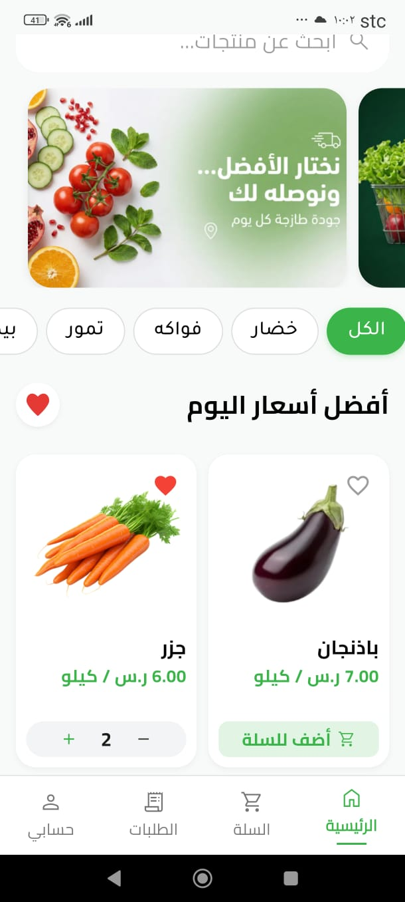
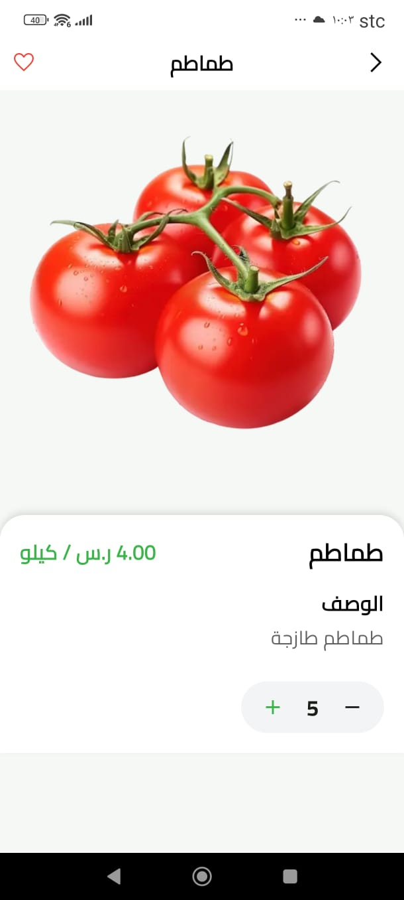
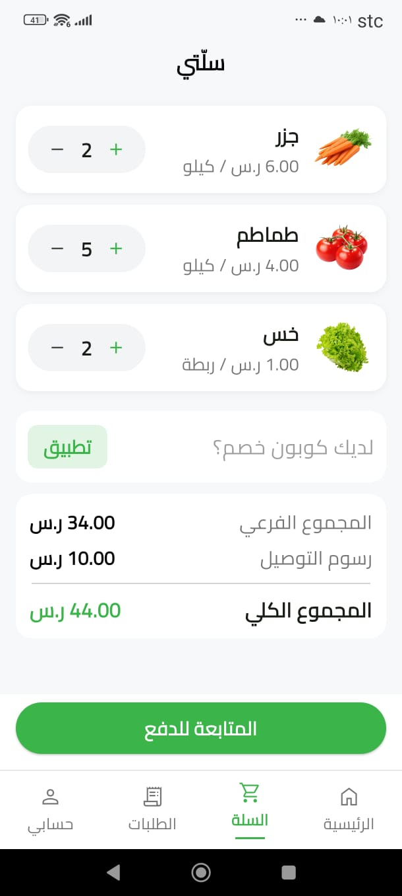
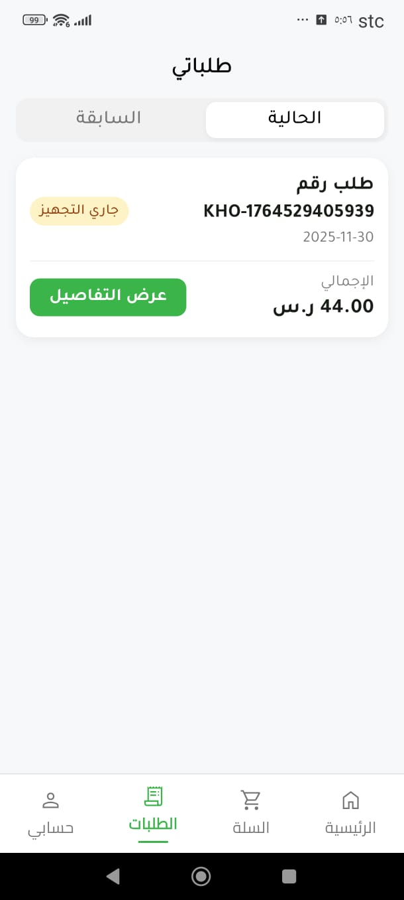
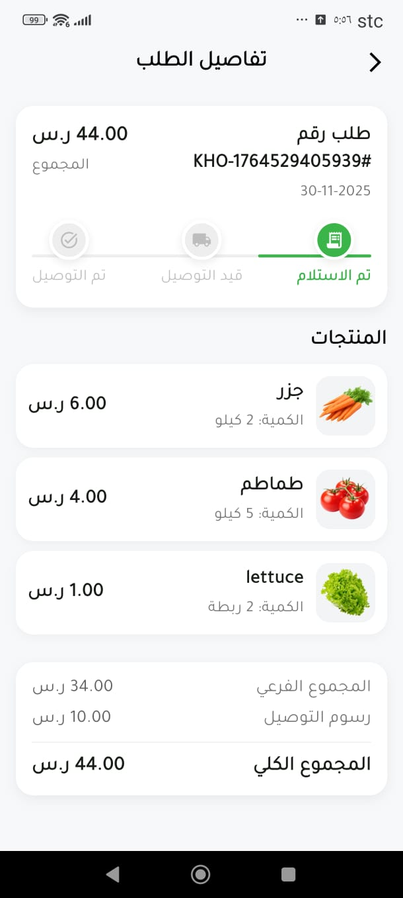

# Khodarkom – Premium Grocery Delivery App 🥬

A fast, modern, and cost-optimized Flutter grocery delivery app for iOS & Android, built with real-time pricing, beautiful UI, and full Firebase backend.
Designed for high performance and a seamless shopping experience in both Arabic 🇸🇦 and English 🇬🇧.

## 🚀 Highlights

*   ⚡ **Real-time Firestore data** (prices, stalls, products).
*   🛒 **Smart Cart System** with instant total updates.
*   📦 **Order Tracking** with detailed history & statuses.
*   🔐 **Secure Phone Authentication (OTP)** for iOS & Android.
*   🌐 **Full Localization** (Arabic & English switch).
*   🖼️ **Optimized images** for ultra-fast performance.
*   🏷️ **Admin panel ready** – real-time sync to the user app.

## 🛠 Tech Stack

*   **Flutter 3.x** (iOS + Android)
*   **Firebase**:
    *   Auth (Phone OTP)
    *   Cloud Firestore
    *   Firebase Storage
    *   Firebase Hosting (Admin Panel)
    *   App Check
*   **Google Cloud**
*   **State Management**: Simple & optimized (setState / Provider)
*   **Responsive UI** for all devices

## 📸 Screenshots

| **Home Screen** | **Product Details** |
|:---:|:---:|
|  |  |

| **My Cart** | **My Orders** |
|:---:|:---:|
|  |  |

| **Order Details** | |
|:---:|:---:|
|  | |

## 🧩 How the System Works

```text
Flutter App (iOS/Android)
      ↓
Firebase Auth (Phone OTP)
      ↓
Cloud Firestore (Products, Prices, Orders)
      ↓
Storage (Product Images)
      ↓
Admin Panel → Updates Firestore → User App (real-time)
```

**Everything is synced instantly — no refresh needed.**

## 🔧 Installation & Running

**Yes, you can run it locally!**

1.  Clone this private repo.
2.  Run:

```bash
flutter pub get
flutter run
```

The app already contains the required Firebase configs.
Works on both iOS and Android, including full OTP verification.

## 🔒 Security Notice

> The repository contains the Firebase configuration files needed to run the app locally.

> These files must not be shared publicly or reused in production environments.
